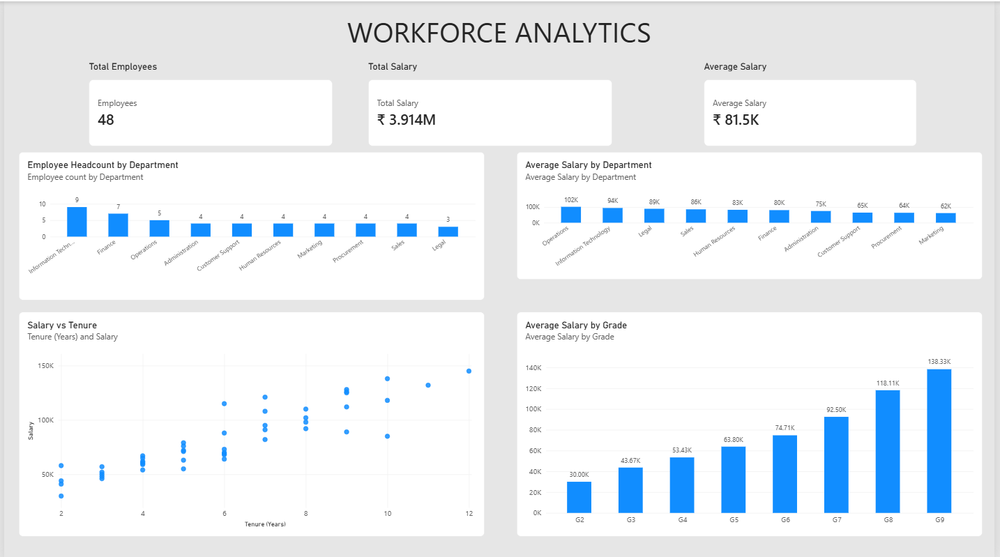

# Workforce Analytics

> A high-level workforce analytics solution that helps HR executives understand workforce distribution and salary patterns across departments and employee grades.

---

## Dashboard Preview



---

## Executive Summary

This analysis provides an overview of workforce composition and salary patterns across a 48-employee workforce. The analysis identified an average salary of approximately ₹81.5K, with Information Technology having the highest headcount (9 employees) and Operations having the highest average salary (₹102K).

A strong positive association was observed between employee salary and tenure, with employee grade and designation providing additional context for the observed salary patterns. The analysis also identified notable differences between individual employee salaries and their respective department averages, with the highest observed deviation being 59.3% above the department average.

These findings should be interpreted as analytical observations rather than evidence of causation or underpayment/overpayment. Factors such as employee performance, qualifications, work experience, and prior compensation history were not available in the dataset. The analysis therefore provides a starting point for further HR review and investigation.

---

## Business Problem

HR leadership had access to workforce data but lacked consolidated insights into average salary, the relationship between salary and employee tenure, and differences between individual salaries and their respective department averages.

---

## Business Objective

The objective of this project is to enable the HR team to understand workforce distribution across departments and grades, and provide insights into the relationship between employee salary and tenure, with grade providing additional context for the observed salary patterns.

The analysis also provides a starting point for investigating differences between individual salaries and their respective department averages and understanding the factors that may contribute to these differences.

---

## Scope

### In Scope

- Analysis of total workforce, total salary, and average salary.
- Analysis of workforce distribution across departments.
- Analysis of average salary across departments.
- Analysis of average salary across employee grades.
- Analysis of the relationship between employee salary and tenure.
- Comparison of individual employee salaries against their respective department averages.
- Development of an interactive Power BI dashboard to present the analytical findings.

### Out of Scope

- Determining whether an individual employee is underpaid or overpaid.
- Establishing causal relationships between salary and tenure, grade, or department.
- Evaluating employee performance or its impact on compensation.
- External market salary benchmarking.
- Predicting future salary, workforce requirements, or employee attrition.
- Making compensation, promotion, or grade-change decisions based solely on this analysis.

---

## Data & Methodology

The analysis started with a synthetic employee dataset containing **48 employee records and 12 source attributes**.

The data was loaded into **Python/Pandas** for exploratory analysis and data-quality validation, including checks for missing values, duplicate employee IDs, data types, ranges, and categorical consistency.

**SQL/DuckDB** was then used for structured analysis, including department-wise aggregations, salary comparisons, filtering, employee rankings, and window-function analysis.

**Python/Pandas and Power BI** were used to examine relationships and patterns, including the relationship between employee salary and tenure. The resulting analysis was presented through an interactive Power BI dashboard covering workforce distribution, salary patterns, grade-level salary differences, and salary-tenure relationships.

### Analytical Workflow

```text
Synthetic Employee Data
        ↓
Python / Pandas
Exploration + Data Quality
        ↓
SQL / DuckDB
Structured Analysis
        ↓
Business Findings
        ↓
Power BI
Interactive Dashboard